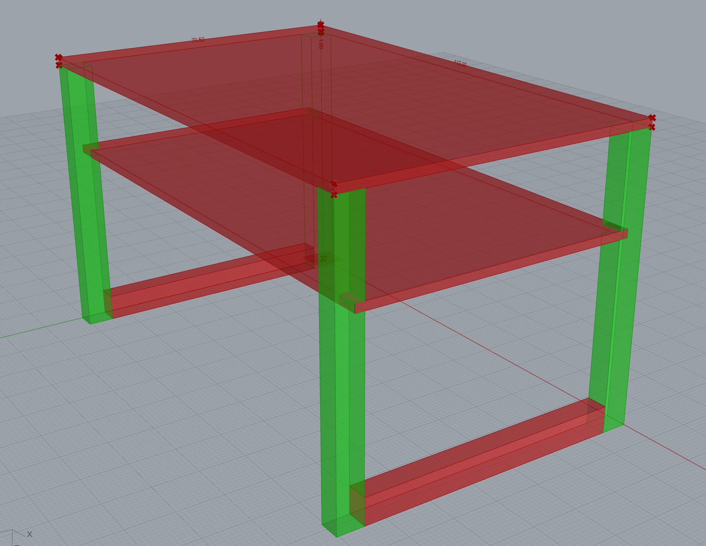

# Hyper Table

Hyper Table est un projet Rhino/Grasshopper de modélisation paramétrique des tables du studio Numérique de l'École Supérieur d'Art d'Aix-en-Provence basé sur les plans originaux de David Poullard.

